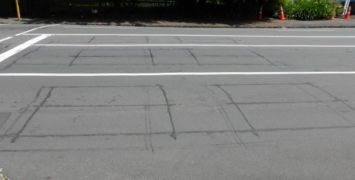
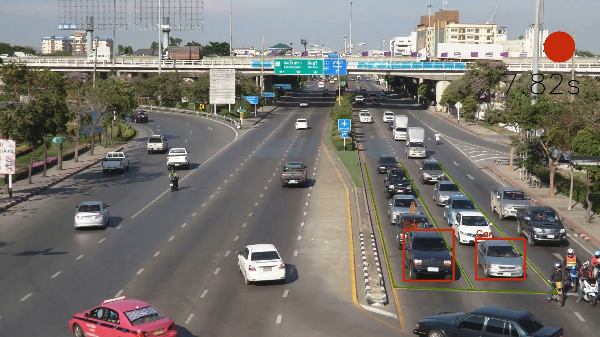
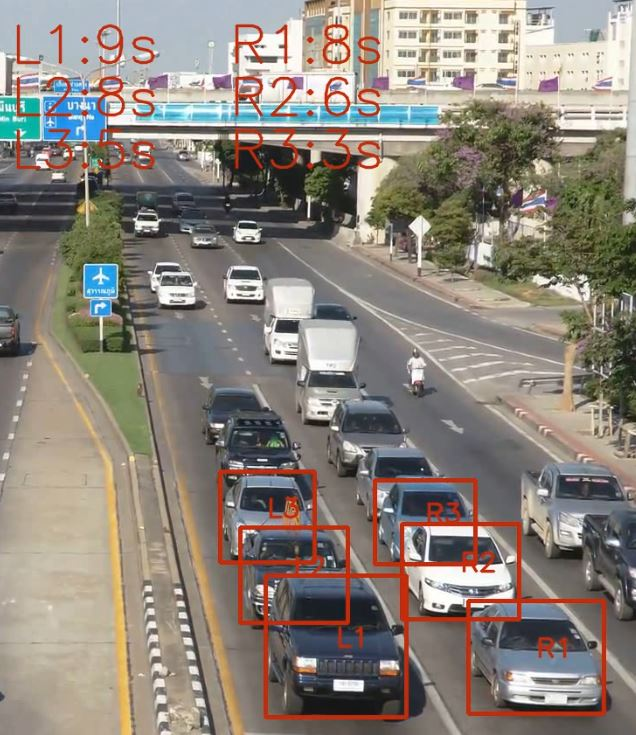
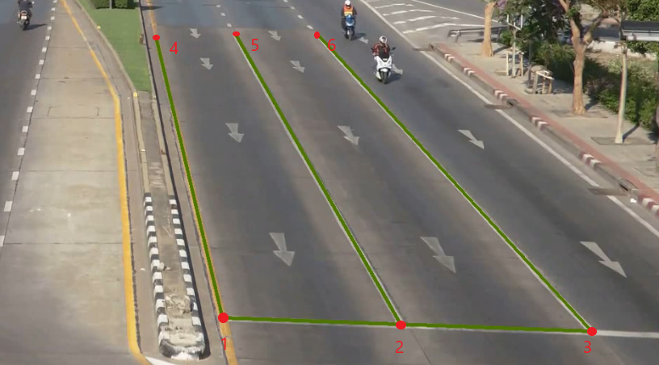

# Traffic Light Dynamic Vehicle Detection and Timing

This project is a proof-of-concept for computer vision to replace induction coils' function for dynamic traffic light control. There has been papers using multiple cameras around the vicinity of the intersection to manage traffic flow, as well as products which uses specially placed cameras to detect presence of vehicles in pre-determined spots, but I wanted to use existing surveillance camera footage and computer vision to track the number of cars in each lane and their respective wait time.

The project is currently still in progress and has 2 versions so far. The versions differ in the way they process information after vehicles in given frame have been identified.
Version 1 simply tracks the most forward vehicle in each lane and calculates the red/green light time. This version is mostly making sure motion tracking works and the motion buffer parameters are set.

Version 2 on the other hand, tracks the n-most forward vehicles in each lane and tracks their motion individually. Each vehicle is given an ID and their individual motion buffer, and their timers are displayed at the top of frame (of course, these numbers are ultimately to be exported to traffic management system for dynamic traffic light control).

# Training the model

About 200 frames of vehicles were labelled by hand with coco-annotator and trained with Detectron2 with success rate of 90-95%. This is because we are only interested in the vehicles facing towards the camera and therefore do not need to consider viewing the vehicles from other angles. The code to train model is included in the main branch, but it is largely the same as that of the tutorial for Detectron2 minus the saving and exporting of trained model.

# Important Parameters for traffic_timer

Each point of the area of interest (aoi) needs to be labelled manually so the algorithm understands where to look for vehicles and where the STOP line is for the intersection. These points are also used to generate perspective index to normalize pixel movement for more accurate motion tracking.

